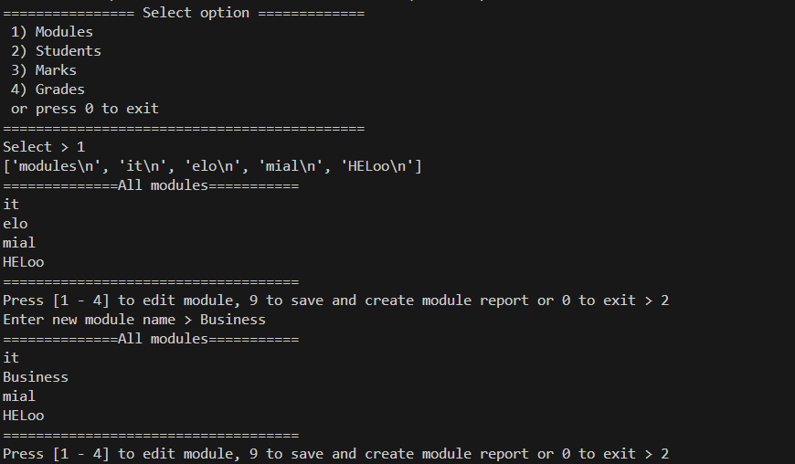

## About The Project

Simple app created completly with Python language.
The app reads the SCV file, allows user to change it and write a report.

Prompts simple menu for user in terminal. User can maitain csv files (our databases) via terminal.
Using procedural programming.

## Key Features:
Read and Edit CSV Files: The app can load student, module, and result data from CSV files.
Modify Records: Users can add, remove, and update entries in the CSV files.
Generate Reports: After entering results, a report is generated and saved as a CSV.
Simple Command-line Interface: The app operates entirely in the terminal for ease of use

## Built With
- Python: A versatile programming language used for the backend logic.
- Python-dotenv: For loading environment variables (e.g., file paths) from a .env file, helping to keep sensitive data and configurations separated from the codebase.

## Set Up Environment Variables
This project uses a .env file to store environment-specific settings like file paths. Make sure you have the following environment variables set in the .env file (you can copy the example below):

RESULTS_FILE_PATH="path/to/results.csv"
MODULES_FILE_PATH="path/to/modules.csv"
STUDENT_FILE_PATH="path/to/students.csv"

## How It Works
Once you run the app, a terminal menu will appear asking the user to choose an option. The available options are:

Modules: Manage the modules (e.g., editing module details).
Students: View, edit, and manage student data.
Marks: Enter and update student results for each module.
Grades: Generate a report based on the entered marks and other data.

  
